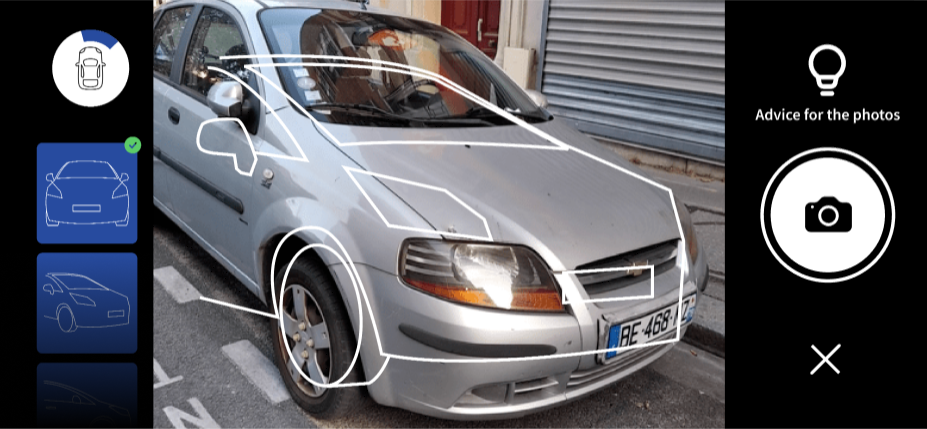

The Camera view takes on a more complete state with **Sights**. We recommend using this `<CameraView />` to take pictures of your vehicles.

``` yarn
yarn add @monkvision/react-native-views @monkvision/corejs @monkvision/react-native
```

⛓️ Peer deps in [`@monkvision/react-native-views/package.json`](https://github.com/monkvision/monkjs/tree/master/packages/react-native-views/package.json)

``` javascript
import { CameraView } from `@monkvision/react-native-views`
```

### Sights

A capture scheme is a list of sights `[Sight]` with a unique string `id` and [cylindrical coordinates](https://en.wikipedia.org/wiki/Cylindrical_coordinate_system) `"(ρφz)"`.

> If our AI can work without this metadata, it analyzes much more easily with it. The Camera view then embeds a list of default sights that you can customize in the near future.

``` json
/* sights.json */

[{
  id: "abstractFront"
  "(ρφz)": { ρ: null , φ: 0, z: null }
}, {
  id: "abstractFrontLeft"
  "(ρφz)": { ρ: null , φ: 30, z: null }
}, {
  id: "abstractFrontLateralLeft"
  "(ρφz)": { ρ: null , φ: 60, z: null }
}, {
  id: "abstractMiddleLateralLeft"
  "(ρφz)": { ρ: null , φ: 90, z: null }
}, {
  id: "abstractRearLateralLeft"
  "(ρφz)": { ρ: null , φ: 120, z: null }
}, {
  id: "abstractRearLeft"
  "(ρφz)": { ρ: null , φ: 150, z: null }
}, {
  id: "abstractRear"
  "(ρφz)": { ρ: null , φ: 180, z: null }
}, {
  id: "abstractRearRight"
  "(ρφz)": { ρ: null , φ: 210, z: null }
}, {
  id: "abstractRearLateralRight"
  "(ρφz)": { ρ: null , φ: 240, z: null }
}, {
  id: "abstractMiddleLateralRight"
  "(ρφz)": { ρ: null , φ: 270, z: null }
}, {
  id: "abstractFrontLateralRight"
  "(ρφz)": { ρ: null , φ: 300, z: null }
}, {
  id: "abstractFrontRight"
  "(ρφz)": { ρ: null , φ: 330, z: null }
}]
```

Can also be simplified
`const abstractSight = new Sight('abstractFront', [null, 0, null]);`

This scheme will enable a wheel indicator displaying the angle we need to take the picture.
Plus an overlay is completing the view helping to take position before taking the picture.


### Usage

``` javascript
/* MyCameraView.jsx */

import React, { useCallback } from 'react';
import { CameraView } from '@monkvision/react-native-views';

export default function MyCameraView() {

  const handleCloseCamera = useCallback((pictures) => {
    console.log(pictures); // [[Sight, CameraPicture], ...]
  }, []);

  const handleTakePicture = useCallback((picture) => {
    console.log(picture); // [Sight, CameraPicture]
  }, []);

  return (
    <CameraView
      onCloseCamera={handleCloseCamera}
      onTakePicture={handleTakePicture}
      analyzeAfterCapture
    />
  );
}
```

**See the [CameraView API](https://monkvision.github.io/monkjs/js/api/react-native-views#CameraView) to more details.**

### Results

Here is an example of `picture` callback response:

``` json
/* console.log(picture) */

[
  // Sight
  { id: "abstractFront", "(ρφz)": { ρ: null , φ: 0, z: null }},
  // NativeCameraPicture
  { source: "base64", ...pictureProps },
]
```

And a preview of what `<CameraView />` looks like.



