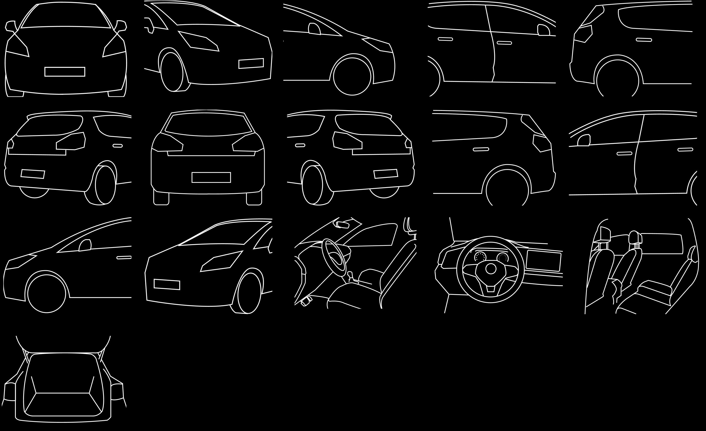

The Camera view takes on a more complete state with **Sights**. We recommend using this `<CameraView />` to take pictures of your vehicles.

``` yarn
yarn add @monkvision/react-native-views @monkvision/corejs @monkvision/react-native
```

⛓️ Peer deps in [`@monkvision/react-native-views/package.json`](https://github.com/monkvision/monkjs/tree/master/packages/react-native-views/package.json)

``` javascript
import { CameraView } from `@monkvision/react-native-views`
```

### Sights Schemes

A capture scheme is a list of sights `[Sight]` with a unique string `id`, a value `tetha` between 0 and 359 and a string `label`.

> If our AI can work without this metadata, it analyzes much more easily with it. The Camera view then embeds a list of default sights that you can customize in the near future.

13. `{ theta: 0, label: "front" }`
14. `{ theta: 30, label: "front right"}`
15. `{ theta: 60, label: "front lateral right"}`
16. `{ theta: 90, label: "middle lateral right"}`
17. `{ theta: 120, label: "rear lateral right"}`
18. `{ theta: 150, label: "rear right"}`
19. `{ theta: 180, label: "rear"}`
20. `{ theta: 210, label: "rear left"}`
21. `{ theta: 240, label: "rear lateral left"}`
22. `{ theta: 270, label: "middle lateral left"}`
23. `{ theta: 300, label: "front lateral left"}`
24. `{ theta: 330, label: "front left"}`

This scheme will enable a wheel indicator displaying the angle we need to take the picture.
Plus an overlay is completing the view showing helping to take position before capture.



### Usage

``` javascript
/* MyCameraView.jsx */

import React, { useCallback } from 'react';
import { CameraView } from '@monkvision/react-native-views';

export default function MyCameraView() {

  const handleCloseCamera = useCallback((pictures) => {
    console.log(pictures); // [[Sight, CameraPicture], ...]
  }, []);

  const handleTakePicture = useCallback((picture) => {
    console.log(picture); // [Sight, CameraPicture]
  }, []);

  return (
    <CameraView
      onCloseCamera={handleCloseCamera}
      onTakePicture={handleTakePicture}
      analyzeAfterCapture
    />
  );
}
```

**See the [CameraView API](/js/api/react-native-views#CameraView) to more details.**

### Results

Here is an example of `picture` callback response:

``` json
/* console.log(pictures) */

[{ theta: 0, label: "front" }, { source: "base64", ...pictureProps }],
[{ theta: 30, label: "front right" }, { source: "base64", ...pictureProps }],
```

And a preview of what `<CameraView />` looks like.


